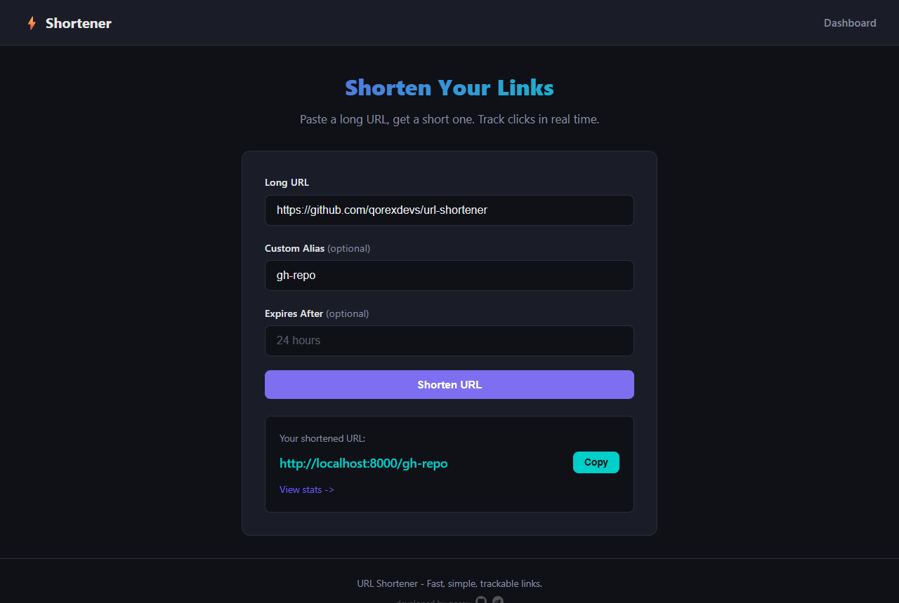
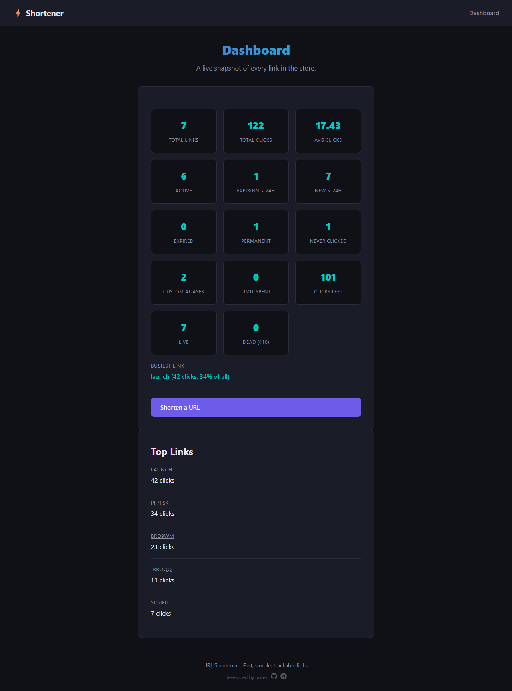

<p align="center">
  <h1 align="center">URL Shortener</h1>
  <p align="center">A fast and simple URL shortener with a dark-themed web UI, custom aliases, and click tracking.</p>
</p>

<p align="center">
  
  
  
  
  
</p>

---

<p align="center">
  
  <br>
  
</p>

## Features

- Shorten URLs with a single click
- Bulk shorten up to 100 URLs in one request
- Bulk delete links by code in one request
- Custom aliases like `/my-link`
- Click tracking with last-clicked timestamp
- Dark-themed responsive UI
- REST API for programmatic access
- QR code generation for any link
- Link preview to see a destination without counting a click
- Link expiration via `ttl_hours`
- Click-limited links via `click_limit` for one-time or capped-use codes
- Permanent (308) redirects opt-in, temporary (307) by default
- Optional query forwarding so a click's `?utm_source=...` reaches the destination
- Idempotent shorten with `reuse` to dedupe the same URL
- Reserved aliases block route collisions
- URL validation allows only `http://` and `https://` schemes
- Async SQLite (aiosqlite)

## Quick Start

```bash
# Clone the repository
git clone https://github.com/qorexdevs/url-shortener.git
cd url-shortener

# Create virtual environment
python -m venv venv
source venv/bin/activate  # Linux/macOS
venv\Scripts\activate     # Windows

# Install dependencies
pip install -r requirements.txt

# Run the server
uvicorn app.main:app --reload
```

Open [http://localhost:8000](http://localhost:8000) in your browser.

### Docker

```bash
docker compose up -d
```

The database is stored in a named volume so your data persists across container restarts.

## API Documentation

### Shorten a URL

```http
POST /api/shorten
Content-Type: application/json
```

Only `http://` and `https://` URLs are accepted, including `localhost` and loopback IP addresses (`127.0.0.1`, `::1`). URLs longer than 2048 characters are rejected.

```json
{
  "url": "https://example.com/very/long/url",
  "custom_alias": "my-link",
  "ttl_hours": 24,
  "permanent": false
}
```

**Response:**

```json
{
  "original_url": "https://example.com/very/long/url",
  "short_url": "http://localhost:8000/my-link",
  "short_code": "my-link",
  "expires_at": "2025-01-02T00:00:00",
  "permanent": false
}
```

`expires_at` is `null` when no `ttl_hours` was set. Set `permanent: true` to redirect with a
cacheable 308 instead of the default 307. Browsers cache it, so later hits skip the server and
stop counting clicks.

Set `reuse: true` to get back an existing live link for the same URL instead of minting a new
code, so shortening the same URL twice stays idempotent. The response carries `reused: true` on a
hit. A `custom_alias` always makes a fresh link, and `ttl_hours`/`permanent` are ignored when an
existing link is returned.

### Shorten in bulk

```http
POST /api/shorten/bulk
Content-Type: application/json
```

```json
{
  "urls": [
    {"url": "https://example.com"},
    {"url": "https://example.org", "custom_alias": "org", "ttl_hours": 24}
  ]
}
```

Each item takes the same fields as a single shorten. Up to 100 per request. Every url is tried
on its own, so a bad one comes back as an error item instead of failing the whole batch:

```json
{
  "results": [
    {"ok": true, "original_url": "https://example.com", "short_url": "http://localhost:8000/aB3xYz", "short_code": "aB3xYz", "expires_at": null, "permanent": false},
    {"ok": false, "original_url": "not-a-url", "error": "Invalid URL"}
  ]
}
```

### Get Link Stats

```http
GET /api/stats/{code}
```

```json
{
  "original_url": "https://example.com/very/long/url",
  "short_url": "http://localhost:8000/my-link",
  "short_code": "my-link",
  "clicks": 42,
  "created_at": "2025-01-01T00:00:00",
  "last_clicked": "2025-01-02T12:30:00",
  "expires_at": "2025-01-02T00:00:00",
  "expired": false,
  "click_limit": 100,
  "exhausted": false,
  "remaining": 58
}
```

`remaining` is how many clicks are left before a capped link starts to 410, `null` when the link has no `click_limit`. It floors at 0 once `exhausted`.

### Summary

```http
GET /api/summary
```

```json
{
  "total_links": 128,
  "total_clicks": 4096,
  "active": 90,
  "expired": 30,
  "permanent": 8,
  "unused": 12,
  "custom": 20,
  "expiring_soon": 4,
  "created_recently": 6,
  "exhausted": 3,
  "capped": 9,
  "remaining_clicks": 184,
  "dead": 32,
  "avg_clicks": 32.0,
  "busiest": "abc123",
  "busiest_clicks": 412,
  "busiest_share": 0.37
}
```

Totals across every link in one call, for a dashboard header. `active` and `expired` exclude permanent links, which have no ttl to be past. `unused` is links with no clicks, `custom` is links created with a custom alias. `expiring_soon` is the live links whose ttl runs out within the next 24h - the ones worth a heads-up before they go dark. `created_recently` is the links made in the last 24h, the counterpart to `expiring_soon`. `exhausted` is the links that spent their click limit and now 410, matching the `status=exhausted` list filter, and `capped` is every link with a click limit set whether or not it's spent (matching `status=capped`), so `exhausted`/`capped` reads as "spent of total capped". `remaining_clicks` is how many redirects are still available across every capped link with room left - the running total of each link's `remaining`, spent links contributing 0 - so you can see at a glance how much redirect budget is left before capped links start to 410. `dead` is how many links a visitor can no longer use because they now 410 - the union of expired and exhausted, matching `status=dead`, with a link that is both counted once. `avg_clicks` is the mean clicks per link, `busiest` is the code of the most clicked one (`null` when there are no links), `busiest_clicks` is its click count (`0` when there are none) and `busiest_share` is the fraction of all clicks that link pulls (`0..1`), a quick read on how concentrated traffic is.

### List Links

```http
GET /api/links                    ->  newest first, 50 per page
GET /api/links?limit=20&offset=40 ->  page through them
GET /api/links?sort=clicks        ->  most clicked first
GET /api/links?sort=recent        ->  most recently clicked first, never-clicked last
GET /api/links?sort=stale         ->  least recently clicked first, never-clicked on top
GET /api/links?sort=expiring      ->  soonest to expire first, no-ttl links last
GET /api/links?sort=code          ->  alphabetical by short path (alias if set, else code)
GET /api/links?sort=remaining     ->  fewest clicks left on the cap first, uncapped links last
GET /api/links?status=active      ->  only links that haven't expired
GET /api/links?status=expired     ->  only links past their ttl
GET /api/links?status=permanent   ->  only permanent 308 links
GET /api/links?status=unused      ->  only links nobody has clicked yet
GET /api/links?status=used        ->  only links with at least one click
GET /api/links?status=exhausted   ->  only links that spent their click limit and now 410
GET /api/links?status=capped      ->  only links with a click limit, spent or not
GET /api/links?status=unlimited   ->  only links with no click limit, the complement of capped
GET /api/links?status=custom      ->  only links given a custom alias, matching the custom count
GET /api/links?status=expiring    ->  only live links whose ttl runs out within 24h
GET /api/links?status=fresh       ->  only links made in the last 24h
GET /api/links?status=live        ->  only links that still redirect - not expired, not out of clicks
GET /api/links?status=dead        ->  only links that now 410 - past their ttl or out of clicks
GET /api/links?q=github           ->  match the destination url, code or alias
GET /api/links?min_clicks=10      ->  only links with at least that many clicks
GET /api/links?max_clicks=1       ->  only links with at most that many clicks
GET /api/links?created_after=2026-01-01   ->  only links created on/after a date
GET /api/links?created_before=2026-06-01  ->  only links created on/before a date
GET /api/links?clicked_after=2026-01-01   ->  only links last clicked on/after a date
GET /api/links?clicked_before=2026-06-01  ->  only links last clicked on/before a date
GET /api/links?expires_after=2026-01-01   ->  only links expiring on/after a date
GET /api/links?expires_before=2026-06-01  ->  only links expiring on/before a date
GET /api/links.csv                ->  download every matching link as csv
GET /api/links.csv?status=active&q=github  ->  same status and q filters
GET /api/links.csv?sort=clicks    ->  same sort orders as the list, most clicked first
```

`created_after` and `created_before` take an ISO date or datetime (a tz-aware value is converted to UTC) and pair into a window, so `created_before=2026-01-01` finds old links to prune. `clicked_after` and `clicked_before` work the same way against `last_clicked`, so `clicked_before=2026-01-01` surfaces links nobody has followed in a while - never-clicked links have no click date and drop out of either bound. `expires_after` and `expires_before` work the same way against `expires_at`, so `expires_before=2026-06-01` finds links about to lapse - links with no ttl never expire and drop out of either bound.

`/api/links.csv` dumps every link matching the same `status`, `q`, `min_clicks`, `max_clicks`, `created_after`/`created_before`, `clicked_after`/`clicked_before` and `expires_after`/`expires_before` filters as a csv (no paging), in the same `sort` order the list takes, with a `Content-Disposition` so a browser downloads it - handy for a backup or a spreadsheet. Columns are `short_code`, `short_url`, `original_url`, `clicks`, `created_at`, `last_clicked`, `expires_at`, `expired`, `permanent`, `forward_query`, `click_limit`, `remaining` and `exhausted`, so the click-limit state survives an export. `click_limit` and `remaining` are blank for uncapped links.

Returns every link with the same fields as stats, newest first. `limit` is 1-100 (default 50) and `offset` skips that many rows, so `offset=limit` gets the next page. The `X-Total-Count` header carries how many links match the current `status` and `q` filters, so you can size the pager without fetching every page. `sort` is `created` (default), `clicks` for the most clicked first, `recent` for the most recently clicked first with never-clicked links last, `stale` for the least recently clicked first with never-clicked links on top (handy for pruning dead links), `expiring` for the soonest to expire first with no-ttl links last, or `remaining` for the capped links with the fewest clicks left first with uncapped links last. `status` is `all` (default), `active`, or `expired`. `min_clicks` keeps only links with at least that many clicks (default 0, so everything) and `max_clicks` keeps only links with at most that many (default unbounded), so `min_clicks=1&max_clicks=1` is an exact range and `max_clicks=0` finds never-clicked links to prune. 400 on a bad `limit`, a negative `offset`, an unknown `sort`, an unknown `status`, a negative `min_clicks`, or a negative `max_clicks`.

### Preview

```http
GET /api/preview/{code}
```

```json
{
  "short_url": "http://localhost:8000/my-link",
  "original_url": "https://example.com/very/long/url",
  "clicks": 42,
  "expires_at": "2025-01-02T00:00:00",
  "expired": false,
  "click_limit": 100,
  "exhausted": false,
  "remaining": 58
}
```

Resolves where a short link points without following it, along with its current click count. No click is counted and there is no redirect, so it is safe for checking a link before opening it. You can also append `+` to the short link itself (`GET /{code}+`) to get the same preview, the way bitly does.

### QR Code

```http
GET /api/qr/{code}                   ->  PNG image
GET /api/qr/{code}?fmt=svg            ->  SVG image
GET /api/qr/{code}?scale=20&border=2  ->  bigger image, tighter quiet zone
GET /api/qr/{code}?download=1         ->  same image as a file download
```

Returns a QR code image encoding the short URL. Useful for sharing links in print or presentations.
PNG by default; pass `fmt=svg` for a crisp, scalable vector you can drop into print or the web.
`scale` sets the pixel size of each module (1-40, default 10) and `border` the quiet zone width (0-20, default 4).
`download=1` adds a `Content-Disposition` so the browser saves the image as `{code}.png`/`.svg` instead of showing it inline.
The `/stats/{code}` page also renders this QR inline with a download link, hidden once the link has expired.

### Retarget

```http
PATCH /api/links/{code}
{ "url": "https://example.org/new", "ttl_hours": 24 }
```

Updates an existing link in place, keeping its code, alias and click count. Send `url` to point it somewhere new, `ttl_hours` to reset the expiry window from now, or `permanent: true` to drop the expiry and promote a temporary link to a permanent 308. At least one is required, and `ttl_hours` with `permanent: true` together is a 400. The URL is validated and normalized like on shorten, and `ttl_hours` follows the same bounds. Returns the updated stats, 400 on a bad URL, bad ttl or an empty body, 404 if nothing matches.

### Delete

```http
DELETE /api/links/{code}  ->  204 No Content
```

Removes a short link by its code or custom alias. Returns 404 if nothing matches. The code lookup is case-insensitive, same as the other endpoints.

### Delete in bulk

```http
POST /api/links/bulk-delete
Content-Type: application/json
```

```json
{"codes": ["aB3xYz", "org", "gone"]}
```

Removes a batch of links by code or alias, up to 100 per request. The response splits them so you can tell a real removal from a code that never existed:

```json
{"deleted": ["aB3xYz", "org"], "not_found": ["gone"]}
```

400 on an empty list or more than 100 codes.

### Purge expired

```http
DELETE /api/expired  ->  { "deleted": 3 }
```

Drops every link that's past its ttl in one pass and returns how many were removed. Links without a ttl are left alone. Handy for a cron job or a manual cleanup so expired rows don't pile up.

### Redirect

```http
GET  /{code}   ->  307 redirect to original URL (308 for a permanent link)
HEAD /{code}   ->  same redirect headers, no body, no click counted
GET  /{code}+  ->  preview the destination instead of following it
```

A `HEAD` request returns the redirect headers without counting a click, so link
checkers and unfurlers can probe a short link without inflating its stats.

## Configuration

| Variable | Default | Description |
|---|---|---|
| `BASE_URL` | `http://localhost:8000` | Base URL for generated short links |
| `DATABASE_URL` | `sqlite+aiosqlite:///./shortener.db` | Database connection string |

## Project Structure

```
url-shortener/
|-- app/
|   |-- __init__.py
|   |-- main.py              # FastAPI application entry point
|   |-- config.py            # Settings and configuration
|   |-- database.py          # Async engine and session
|   |-- models.py            # SQLAlchemy URL model
|   |-- schemas.py           # Pydantic schemas
|   |-- utils.py             # Short code generation
|   |-- routers/
|   |   |-- __init__.py
|   |   |-- api.py           # REST API endpoints
|   |   `-- pages.py         # Web UI routes
|   |-- templates/
|   |   |-- base.html        # Base layout
|   |   |-- index.html       # Main page (shorten form)
|   |   `-- stats.html       # Link statistics page
|   `-- static/
|       |-- css/style.css    # Dark theme styles
|       `-- js/main.js       # Frontend logic
|-- Dockerfile
|-- docker-compose.yml
|-- requirements.txt
|-- .gitignore
`-- README.md
```

## Tech Stack

| Component | Technology |
|---|---|
| Framework | FastAPI 0.115 |
| ORM | SQLAlchemy 2.0 (async) |
| Database | SQLite via aiosqlite |
| Templates | Jinja2 |
| Frontend | Vanilla HTML/CSS/JS |
| Server | Uvicorn |

## License

MIT


---

<p align="center">
  <sub>developed by <a href="https://github.com/qorexdevs">qorex</a></sub>
  <br>
  <sub>
    <a href="https://github.com/qorexdevs">GitHub</a> | <a href="https://t.me/qorexdev">Telegram</a>
  </sub>
</p>
